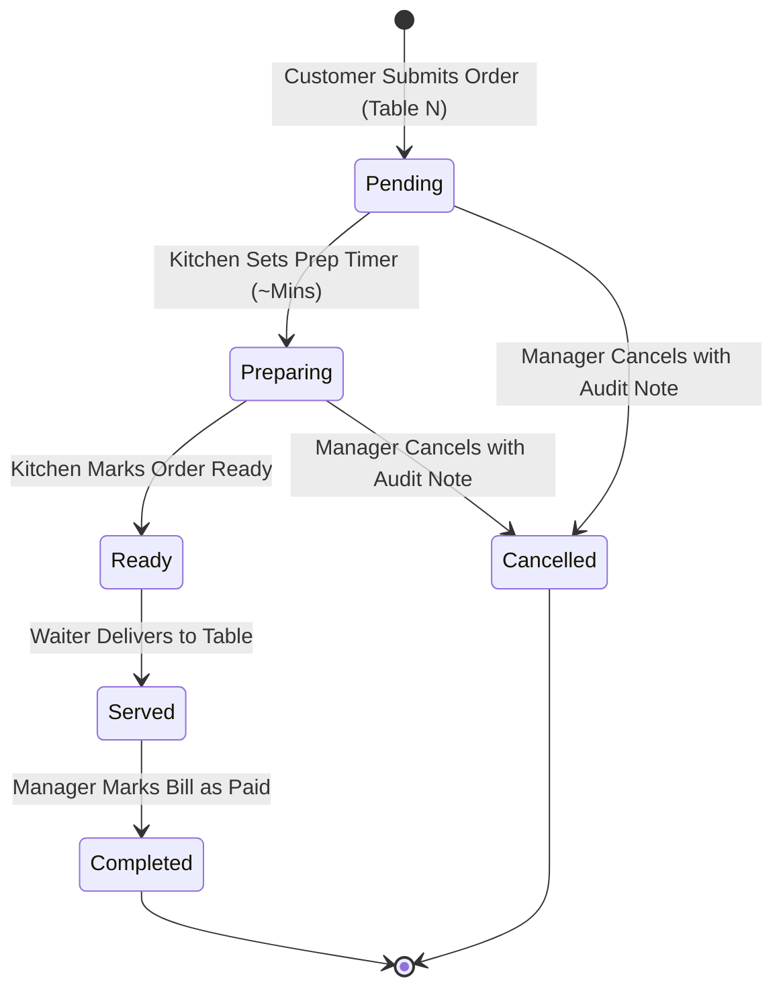

# 📋 MIRCHI 360 — PRODUCT REQUIREMENTS DOCUMENT (PRD)
> **Version:** 2.0 | **Date:** 2026-09-30 | **Status:** Active Production Source of Truth

---

## 1. SYSTEM OVERVIEW & ARCHITECTURE

**Mirchi 360** is a multi-tenant, high-concurrency, real-time Point-of-Sale (POS), Kitchen Display System (KDS), and Digital QR Code Table Ordering platform built for restaurant chains with multiple operational branches (e.g., Defence & Qasimabad).

### Core Goals:
1. **Zero Wait-Staff Ordering Friction:** Customers scan table-specific QR codes and place orders directly to the kitchen with 0-touch wait staff delays.
2. **Sub-Second Real-Time Synchronization:** Orders punched by customers instantly appear on Kitchen Display Systems (KDS) and Manager consoles via WebSocket channels.
3. **Strict Multi-Tenant & Branch Data Isolation:** Orders, waiter calls, complaints, and sales reports are partitioned by `restaurant_id` and `branch_id`.
4. **Session Integrity & Zero-Drop Rehydration:** Staff sessions, branch selections, and table identities persist reliably across page refreshes.
5. **Mobile-First 60fps Experience:** Sub-2 second load times, GPU-composited layers, and clean offline queuing when network fluctuates.

---

## 2. USER ROLES & ACCESS MATRIX

| User Role | Entry Point | Authentication Mechanism | Permissions & Scope |
|---|---|---|---|
| **End-Customer (QR Table)** | `/?table=N&branch=X` | None (Public QR / Anonymous Session) | Browse active menu, add to cart with variants, submit table order, call waiter, log complaint, track active table orders. |
| **Kitchen Staff** | `/kitchen` or `/staff` | Role: `kitchen` + 4-digit numeric PIN | View live order queue for assigned branch, toggle `pending` → `preparing` (with estimated prep minutes), toggle `preparing` → `ready`. |
| **Multi-Branch Manager** | `/manager` or `/staff` | Role: `manager` + 4-digit numeric PIN | Full supervisory control over assigned branch: mark orders `served`, mark bills `paid`, cancel orders with audit, resolve waiter calls/complaints, execute Shift Closing (Z-Report). |
| **Super Admin** | `/admin` or `/staff` | Role: `admin` + Username & Password | Multi-branch analytics, revenue breakdown by shift/branch, menu catalog management (pricing, out-of-stock toggles, variants), audit logs inspection (capped at max 3 concurrent sessions). |

---

## 3. PRIMARY SYSTEM WORKFLOWS

### 3.1 QR Code Scanning & Customer Ordering
1. Customer scans table QR code: opens `https://domain/?table=4&branch=branch-def`.
2. URL sanitization extracts `tableNumber = 4` and `branch = branch-def`.
3. Customer browses categorized digital menu, clicks anywhere on a product card or uses in-card `[-] [qty] [+]` controls to draft their cart.
4. If an item has portion/size variants (e.g., Pizzas, Handi, Rolls), a variant modal prompts for selection before adding.
5. Cart is persisted in `localStorage ('mirchi_cart_items')` to survive accidental page reloads.
6. Customer reviews cart and clicks **"Send Order to Kitchen"**:
   - Order is validated and assigned a branch-level sequential order number.
   - Inserted into Supabase `orders` and `order_items` tables with a resilient 8-second network timeout.
   - Offline queue fallback activates if the device is offline or network fails.
   - Cart clears, and the customer UI auto-navigates to the **Active Orders Tracking** tab.

### 3.2 Real-Time Order Lifecycle & State Machine

- **Pending:** Order received in kitchen. Status badge pulses amber. Sound chime alerts cooks.
- **Preparing:** Chef accepts order and assigns estimated preparation minutes. Customer sees live prep timer countdown.
- **Ready:** Food is plated and ready for pickup. Customer sees prominent "Order Ready" banner.
- **Served:** Food delivered to table. Customer sees clear itemized bill summary with "Bill: Unpaid".
- **Completed:** Bill settled with server or cashier. Order is marked `Paid`, and automatically disappears from customer active tracking.

### 3.3 Kitchen Display System (KDS)
- Auto-filters orders by the kitchen staff member's assigned `branch_id`.
- Realtime WebSocket updates trigger audio alarms upon new incoming orders.
- Audio alert uses browser Web Audio API / HTML5 Audio with user interaction unlocking.
- Kitchen Help Call system allows stations to broadcast assistance alerts.

### 3.4 Manager Supervision & Shift Closing (Z-Report)
- Managers supervise active orders, open customer complaints, and pending waiter calls.
- Sensitive actions (order cancellations, bill adjustments) require validation of a 4-digit Privacy PIN (`privacy_pin`).
- **Shift Handover / Z-Report:** At shift conclusion (Morning, Evening, Night), the manager executes Shift Closing. Generates structured revenue breakdown (Gross Sales, Cash, Card, Other, Discounts, Order Counts) and saves to `branch_reports`.

### 3.5 Role-Based Authentication & Session Persistence
- Session token and credentials stored in `localStorage ('mirchi_auth_session')`.
- Root router synchronously rehydrates session before mounting protected routes, eliminating logout flicker on browser refresh.
- Admin concurrency control limits active admin sessions to 3 across devices.

---

## 4. DATA SANITIZATION & SECURITY RULES
1. **XSS Prevention:** All user-supplied inputs (customer notes, complaints, names) pass through `sanitizeTextInput` to strip script tags, style injections, and control characters.
2. **PIN Enforcement:** Staff PINs must strictly adhere to 4 numeric digits.
3. **Table & Branch Bounds:** Table numbers bounded to valid integers (1–10). Branch identifiers restricted to known branch slugs/UUIDs.
